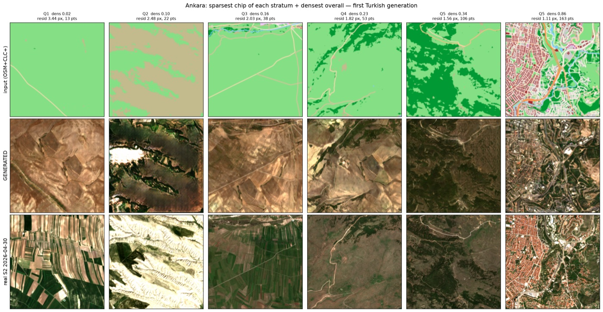
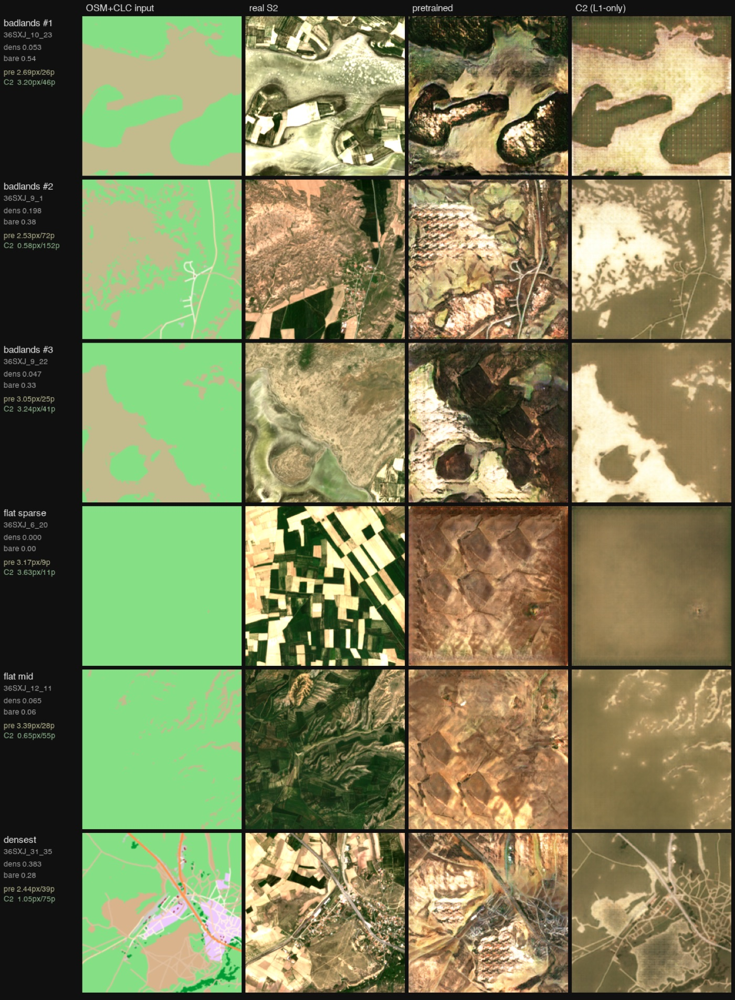
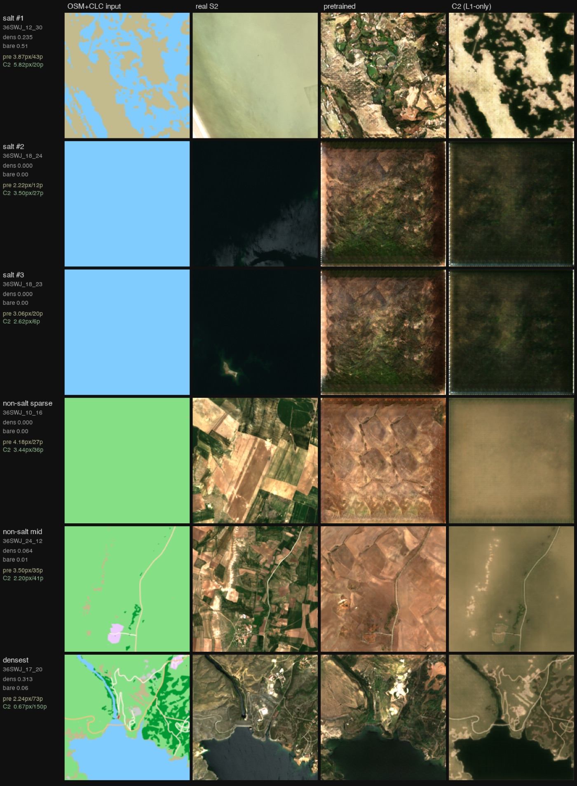
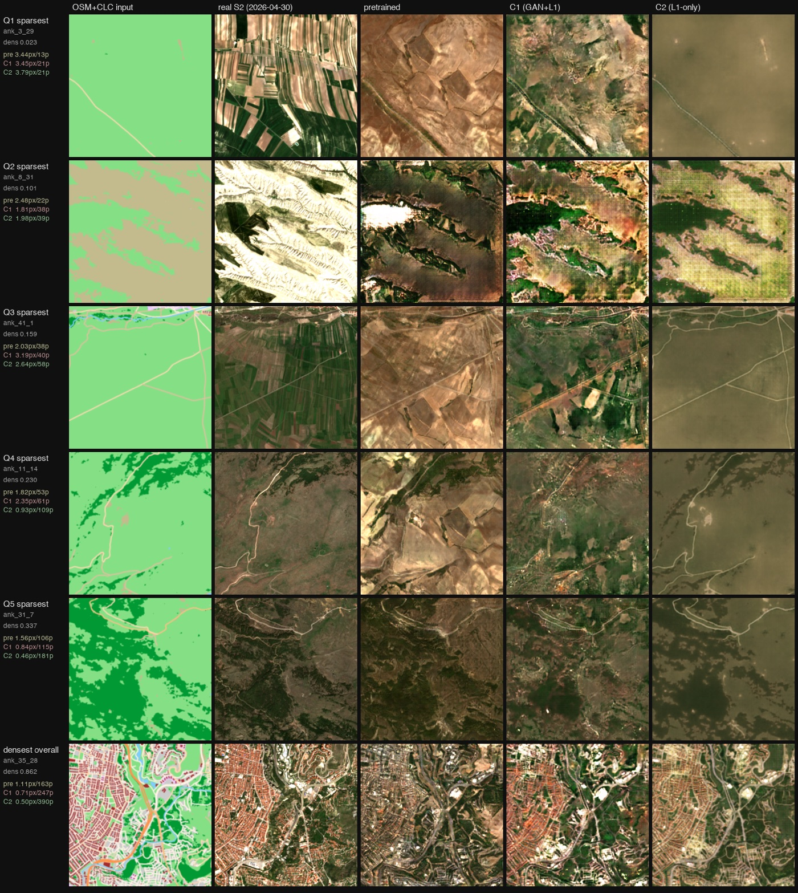
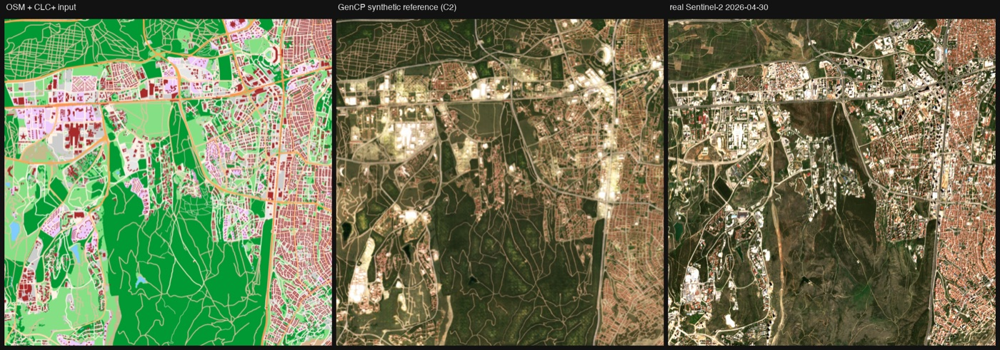

# GenCP Doğrulama Çalışması

Bu repo, harita verisinden **sahte ama gerçekçi uydu görüntüsü** üreten bir yapay zekâ
sistemini ölçen, doğrulayan ve iyileştiren bir çalışmanın kaydıdır.

Kısaca hikâye: ESA'nın **GenCP** projesi ([telespazio-tim/GenCP](https://github.com/telespazio-tim/GenCP)),
OpenStreetMap (OSM) haritalarını **pix2pix** adlı bir üretici ağa (koşullu GAN) verip
sentetik Sentinel-2 (S2) görüntüsü üretiyor. Amaç, bu sentetik görüntüleri **GCP** (yer
kontrol noktası — uydu görüntülerinin geometrik doğruluğunu ölçmekte kullanılan,
koordinatı hassas bilinen referans noktalar) için telifsiz referans chip'leri olarak
kullanmak. Biz de TÜBİTAK UZAY stajı kapsamında (Ağustos 2026) bu yayınlanmış sistemi
teslim aldık, "gerçekten işe yarıyor mu, nerede aksıyor?" sorusunu ölçerek yanıtladık
ve Türkiye'ye genelleme hattını kurduk.

Modelin yaptığı iş tek satırda — soldaki haritadan sağdaki görüntü üretiliyor:

| OSM rasteri (girdi) | Gerçek S2 görüntüsü | Üretilen görüntü |
|:---:|:---:|:---:|
|  |  |  |

## Öne çıkanlar

* Yayınlanan üründe **+1/256 georeferanslama ölçek hatası** bulundu (karo köşesinde
  14.1 m); düzeltme, teslim ettiğimiz araca gömüldü
* Geometrik doğrulamada, upstream'in kendi raporladığı istatistikte **4.5× daha iyi**
  sonuç ölçüldü (0.155 px'e karşı 0.70 px sistematik kayma; 1 px = 10 m)
* Model, eğitim verisinin hiç kapsamadığı **Türkiye'de ilk kez koşturuldu**; kendi
  rasterizer'ımız kabul kapısını geçti, **ODTÜ referans paketi** üretilip teslim edildi
* Kayıp fonksiyonu sorusu için model **sıfırdan yeniden eğitildi** (2×2 faktöriyel);
  seed replikasyonu bulut GPU'da sürüyor
* Her deney önden kayıtlı (registration), her hata düzeltme günlüğünde — **hiçbir şey
  silinmez, her iddianın kaynağı tıklanabilir**

## Nereden başlamalı?

Yeni geldiyseniz sırayla:

1. **Bu README** — projenin ne olduğu, neler bulunduğu, neyin nerede olduğu (5-10 dk)
2. [`tubitak/DEVIR.md`](tubitak/DEVIR.md) — devir rehberi: dosya haritası, çalıştırma, açık işler
3. [`tubitak/README.md`](tubitak/README.md) — çalışma alanı rehberi (**İngilizce**):
   ortam kurulumu, bilinen tuzaklar, script'lerin tek tek ne yaptığı, ayrıntılı bulgu tablosu
4. [`tubitak/docs/`](tubitak/docs/) — her deneyin kayıt ve sonuç dosyaları; hangi
   dosyanın ne olduğu için aşağıdaki [kod adları tablosuna](#deney-kod-adları) bakın

Terimlere takılırsanız: [Hızlı sözlük](#hızlı-sözlük) en altta.

### Ne nerede?

| Aradığınız | Yeri |
|---|---|
| Bulguların ayrıntılı tablosu ve güncel durum | [`tubitak/README.md`](tubitak/README.md) |
| Deney kayıtları ve sonuç raporları | [`tubitak/docs/`](tubitak/docs/) — her deney `*-registration.md` + `*-results.md` çifti |
| Hata/düzeltme geçmişi (hangi iddia neden değişti) | [`tubitak/docs/corrections-log.md`](tubitak/docs/corrections-log.md) |
| Açık işler listesi | [`tubitak/docs/open-items.md`](tubitak/docs/open-items.md) |
| Teslimat aracı (referans üreteci) | [`tubitak/tool/gencp_ref.py`](tubitak/tool/gencp_ref.py) |
| Eğitim kodu — Kaggle | [`tubitak/kaggle/`](tubitak/kaggle/) |
| Eğitim kodu — Modal (bulut GPU) | [`tubitak/modal/`](tubitak/modal/) |
| Ölçüm/analiz script'leri | [`tubitak/scripts/`](tubitak/scripts/) |
| Türkçe ilerleme ve sonuç raporları | [`tubitak/rapor2/`](tubitak/rapor2/), [`tubitak/rapor3/`](tubitak/rapor3/) |
| Veri kaynakları, sürümler, sağlamalar | [`tubitak/docs/data-sources.md`](tubitak/docs/data-sources.md) |
| Upstream pix2pix/GenCP kodu | repo kökündeki geri kalan her şey (değiştirilmedi) |

### Deney kod adları

Repo boyunca göreceğiniz kısa kodların anlamı:

| Kod | Ne | Nerede |
|---|---|---|
| **C1–C5** | Kayıp fonksiyonu eğitim kolları: C1 = GAN+L1, C2 = yalnız L1, C4 = GAN+LPIPS, C5 = yalnız LPIPS; C3 = kazanan kol + Avrupa korpus ekleri | [phase-c-results.md](tubitak/docs/phase-c-results.md), [phase-c-lpips-results.md](tubitak/docs/phase-c-lpips-results.md), [phase-c-europe-results.md](tubitak/docs/phase-c-europe-results.md) |
| **Arm A/B/C** | KARIOS doğrulama koşusundaki üç georeferanslama varyantı (eğitim kollarıyla karıştırmayın) | [karios-validation.md](tubitak/docs/karios-validation.md) §3 |
| **B1–B3** | Başlık ölçümleri — faktöriyel sonucunun sağlamlık kontrolleri | [headline-results.md](tubitak/docs/headline-results.md) |
| **T1, T3** | Gerçek görüntüye karşı kıyas (T1) ve güvenilirlik katmanı (T3) | [T1-benchmark-results.md](tubitak/docs/T1-benchmark-results.md), [T3-reliability-results.md](tubitak/docs/T3-reliability-results.md) |
| **E1–E3** | Konumlandırma ölçümleri: "sentetik referans neden gerekli" gerekçesinin üç öncülünün testi | [positioning-results.md](tubitak/docs/positioning-results.md) |
| **Faz D** | Zorlu saha koşuları: Kapadokya ve Tuz Gölü | [phase-d-results.md](tubitak/docs/phase-d-results.md) |
| **SEED-a/b** | Seed replikasyonunun kayıt ve donanım kapıları | [seed-replication-registration.md](tubitak/docs/seed-replication-registration.md) |
| **Option A** | Georeferanslama afin düzeltmesi (araca gömülü hali) | [geometry-finding.md](tubitak/docs/geometry-finding.md), [tool-results.md](tubitak/docs/tool-results.md) |

## Ne bulundu?

Aşağıdaki bulguların her biri ölçüldü; yöntemi, sayıları ve "hangi sonuç bu iddiayı
çürütürdü" ölçütü ilgili dokümanda yazılı.

### 1. Yayınlanan üründe georeferanslama ölçek hatası var (+1/256)

Yayınlanan `gencp_georeferencing.py`, 256 piksellik üretilmiş görüntüyü 257 piksellik
kaynağın koordinat dönüşümüyle eşliyor (korpus çiftleri 257×257 px kaydedilmiş, model
256×256 üretiyor). Sonuç: gerçek piksel boyutu (GSD) 10.039 m iken 10.0 m beyan
ediliyor. Hata kuzeybatı köşede sıfır, güneydoğu köşede **14.1 metre** — ürün, köşeye
doğru sistematik biçimde kayıyor. Üç bağımsız kanıt hattıyla gösterildi, KARIOS ile
bağımsız olarak teyit edildi. → [geometry-finding.md](tubitak/docs/geometry-finding.md)

*Kayma alanı: her ok, o bölgedeki konum hatasını gösterir (40× abartılı). Sabit
noktadan (KB köşesi) uzaklaştıkça hata düzenli büyür — ölçek hatasının imzası.*

### 2. Model, haritada olmayan yapılar "uyduruyor" (halüsinasyon)

Üreteç, OSM girdisinin **2.1 katı** kenar yoğunluğu üretiyor ve girdi ne kadar boş
olursa olsun çıktıyı "gerçek uydu görüntüsü kadar dolu" gösteriyor. Bu, boş kırsal
haritalardan üretilen görüntülerin güvenilirliğini düşürüyor; tek bir eşikle
ayıklamak mümkün değil — siteleri sıralamak gerekiyor.
→ [hallucinated-structure.md](tubitak/docs/hallucinated-structure.md)

*Alt sol panel özet: üretilen/gerçek kenar yoğunluğu oranı, girdi ne kadar boş olursa
olsun ~1.0 — model açığı uydurarak kapatıyor.*

### 3. Seyrek haritalı bölgelerde konum doğruluğu düşüyor — ve bu GenCP'ye özgü

OSM'de az detay olan chip'lerde eşleştirme hatası artıyor (kısmi korelasyon
rho = −0.61). Aynı analiz **gerçek** görüntüyle tekrarlandığında etki kayboluyor —
yani sorun "eşleştirmesi zor arazi" değil, sentetik ürünün kendisi.
→ [karios-validation.md](tubitak/docs/karios-validation.md)

### 4. KARIOS doğrulaması: sayıların aslı

KARIOS (görüntü eşleştirmeyle geometrik doğruluk ölçen açık araç) ile, kendi
kurduğumuz yer gerçeği (ground truth) setine karşı üç kollu bir koşu yapıldı.
Upstream'in kendi yayınında raporladığı istatistik (global sistematik kayma) bizim
koşuda **0.155 px** çıktı — upstream'in raporladığı 0.70 px'ten **4.5× iyi**
(1 px = 10 m). Bulgu 1'deki düzeltme bu sistematik kaymayı **%40.3** azaltıyor.
Kalan ~2 px'lik hata tabanı bizim kurulumdan değil, lokal eşleştirmenin kendisinden
geliyor. → [karios-validation.md](tubitak/docs/karios-validation.md)

### 5. Veri setinde kusurlar var

Yayınlanan korpusta 9 sızmış test chip'i ile 25 demo/eğitim çakışması bulundu
([geometry-finding.md §12](tubitak/docs/geometry-finding.md)); ayrıca doğrulanmış 566
test chip'inin 323'ünde OSM yarısı, georeferanslı rasteriyle bayt-özdeş değil
([karios-validation.md](tubitak/docs/karios-validation.md), "Dataset note"). Hepsi
upstream'e raporlanmak üzere kayda geçirildi.

## Türkiye'ye genelleme

Eğitim korpusu tamamen Batı/Orta Avrupa'dan; Türkiye kuşağından tek bir karo bile
korpusta yok. Yani modeli Türkiye'de koşturmak gerçek bir **coğrafi genelleme
testi**. Ankara üzerinde veri edinimi tamamlandı ve doğrulandı
([ankara-acquisition.md](tubitak/docs/ankara-acquisition.md)); ilk üretimler alındı:

*Türkiye sahasından ilk üretim (Ankara): üst sıra girdi haritası (OSM+CLC+), orta sıra
üretilen görüntü, alt sıra gerçek Sentinel-2. Soldan sağa harita detayı artıyor;
detay arttıkça üretim gerçeğe yaklaşıyor — halüsinasyon ve seyrek-harita bulgularının
sahadaki görünümü.*

Kendi OSM rasterizer'ımız yayınlanan palete oturtuldu. İlk kabul denemesi (yalnız OSM)
KARIOS kapısını geçemedi; ikinci deneme (ESA WorldCover taban katmanı) da yetmedi.
Teşhis, referans rasterların OSM'nin altında **CLC+ Backbone** arazi örtüsü katmanı
kullandığıydı — CLC+ ile kurulan üçüncü sürüm, yeniden üretilmiş girdilerle koşulan
kabul kapısını **geçti** (+0.119 ± 0.138 px; sıfırdan istatistiksel olarak ayırt
edilemez).
→ [renderer-tolerance.md](tubitak/docs/renderer-tolerance.md)

### Zorlu sahalar: Kapadokya ve Tuz Gölü

Modelin sınırlarını görmek için iki bilinçli zor saha seçildi
(→ [phase-d-results.md](tubitak/docs/phase-d-results.md),
güvenilirlik katmanı için [T3-reliability-results.md](tubitak/docs/T3-reliability-results.md)):

*Kapadokya (peribacaları/badlands): OSM'nin neredeyse boş olduğu satırlarda ("flat
sparse") yayınlanan model (pretrained sütunu) araziye yine de doku uyduruyor; C2 kolu
uydurmayı reddedip düzleşiyor — halüsinasyon bulgusunun en çıplak hali.*

*Tuz Gölü: girdi "su" diyor, gerçekte doku(suz) tuz gölü yüzeyi var. Yayınlanan model
üzerine kayalık bir manzara uyduruyor; C2 koyulaştırıp yine de dokuluyor — iki model
de bu sınıfı hiç görmemiş. Harita etiketinin gerçeği temsil etmediği yerlerde sentetik
referansın tek başına neden kullanılmaması gerektiğinin örneği.*

## Model yeniden eğitildi mi? Evet — kayıp fonksiyonu deneyi

"GAN kaybı gerçekten gerekli mi, L1/LPIPS ne katıyor?" sorusu için model sıfırdan,
2×2 faktöriyel düzende yeniden eğitildi:

| Kol | Kayıp | Nerede eğitildi |
|---|---|---|
| C1 | GAN + L1 (upstream varsayılanları) | Kaggle, T4 |
| C2 | Yalnız L1 | Kaggle, T4 |
| C4 | GAN + LPIPS | Kaggle, T4 |
| C5 | Yalnız LPIPS | Kaggle, T4 |

(LPIPS: piksel farkı yerine algısal benzerliği ölçen öğrenilmiş metrik. Yayınlanan
modelin ayırt edici ağı (discriminator, "D") paylaşılmadığı için C1'de önceden
kayıtlı bir ısınma protokolü uygulandı; C2/C5 için Kaggle kopyasına, GAN terimini
sıfırlayan 3 satırlık bir yama. Kol başına 20 epoch.)

Sonuçlar kayıtlara karşı skorlandı: [phase-c-results.md](tubitak/docs/phase-c-results.md),
[phase-c-lpips-results.md](tubitak/docs/phase-c-lpips-results.md),
başlık ölçümleri [headline-results.md](tubitak/docs/headline-results.md).
Aşağıda kolların Ankara'daki davranışı — GAN'lı kol (C1) doku üretiyor, yalnız-L1
kolu (C2) "ortalamaya kaçıp" yumuşuyor:

*Ankara chip'leri, harita yoğunluğu kademeleri boyunca: soldan sağa girdi, gerçek S2,
yayınlanan model, C1, C2. Sol kenardaki yeşil sayılar her kolun konum hatası (px) ve
eşleşen nokta sayısı.*

Şu anda bu sonuçların **tohum (seed) düzeyinde replikasyonu** Modal bulut GPU'sunda
(A10G) koşuyor — tek eğitimden çıkan farkın şansa değil kayıp fonksiyonuna ait
olduğunu göstermek için. → [seed-replication-registration.md](tubitak/docs/seed-replication-registration.md)

## Somut çıktı: ODTÜ referans paketi

Teslimat aracının ilk kurumsal ürünü: ODTÜ kampüsü ve çevresi için georeferanslı
sentetik referans + chip bazlı güvenilirlik katmanı, alıcı README'siyle paketlendi
(→ [odtu-package-README.md](tubitak/docs/odtu-package-README.md); paket
binary'leri sürüm kontrolü dışında tutulur, araçla yeniden üretilebilir):

*Soldan sağa: OSM+CLC+ girdisi, üretilen GenCP referansı (C2 kolu), gerçek Sentinel-2
(30 Nisan 2026). Paketin C2 ile üretilmesi bilinçli: C2 görsel olarak daha yumuşak
olsa da buradaki amaç doku değil geometrik doğruluk — yoğun chip'lerde C2'nin konum
hatası daha düşük, nokta verimi daha yüksek (yukarıdaki karşılaştırma görselindeki
yeşil sayılar).*

## Güncel durum (25 Ağustos 2026)

* ✅ Geometri bulgusu doğrulandı; düzeltme (Option A) teslimat aracına gömüldü:
  [`tubitak/tool/gencp_ref.py`](tubitak/tool/gencp_ref.py) — deterministik referans
  üreteci (aynı girdi → bayt-özdeş çıktı), provenance bilgisi çıktıya işleniyor
* ✅ Faz C faktöriyeli eğitildi ve skorlandı (yukarıda)
* ✅ T1: gerçek görüntü, erişilebildiği her yerde sentetik referansı belirgin biçimde
  geçiyor; T3: chip bazlı güvenilirlik katmanı öneri olarak paketlendi
* ✅ E1–E3 konumlandırma ölçümleri: "sentetik referans gerekli çünkü gerçek görüntüye
  erişim yok/zor" gerekçesinin üç öncülü de yazıldığı haliyle ölçümde düşüyor
  ([positioning-results.md](tubitak/docs/positioning-results.md)). **Kapsam notu:**
  hedef ortam uyduda **offline** kullanım — gerçek referansa erişimin olmadığı bu
  senaryoda gerekçe ayakta kalır; sonuçlar bu bağlamla birlikte okunmalı
* ✅ Türkiye rasterizer'ı CLC+ Backbone taban katmanıyla kabul kapısını geçti (yukarıda)
* 🔄 Seed replikasyonu Modal A10G'de koşuyor (SEED-b, yukarıda)
* 📝 Yayın: IEEE GRSL letter, kayıp fonksiyonu sonucuna odaklı
  ([paper-roadmap.md](tubitak/docs/paper-roadmap.md))
* 📄 Türkçe raporlar: [`tubitak/rapor2/`](tubitak/rapor2/) (ilerleme),
  [`tubitak/rapor3/`](tubitak/rapor3/) (sonuç; PDF'ler `rapor3/build_pdf.py` ile üretilir)

## Kullanılan veri

| Veri | Kaynak | Not |
|---|---|---|
| HR eğitim korpusu `GenCP_HR_DB.zip` (1.6 GB) | [Zenodo 15044428](https://zenodo.org/records/15044428) | 5.708 çift (5.131 eğitim + 577 test): Sentinel-2 yaması + OSM rasteri, 10 m GSD; ölçümlerde bunun doğrulanmış 566 chip'lik test kümesi kullanıldı. Kusur envanteri: bulgu 5 |
| Yayınlanan HR model ağırlıkları (RGB, 208 MB) | Zenodo 15044428 | MD5 sağlamaları [data-sources.md](tubitak/docs/data-sources.md)'de |
| CLC+ Backbone 10 m | Copernicus | OSM rasterlarının altındaki arazi örtüsü taban katmanı (boşluk doldurma) |
| Ankara/Türkiye | Sentinel-2 + OSM | Edinim ve doğrulama: [ankara-acquisition.md](tubitak/docs/ankara-acquisition.md) |

`tubitak/data/` ve `tubitak/outputs/` git dışıdır; her şey
[data-sources.md](tubitak/docs/data-sources.md)'deki kayıtlardan yeniden indirilebilir/üretilebilir.

## Nasıl çalıştırılır?

1. **Ortam:** [`tubitak/README.md`](tubitak/README.md) → "Environment setup".
   Kuruluma başlamadan "Known issues" bölümünü okuyun — OpenMP çakışması ve visdom
   kurulum tuzağına herkes düşüyor, çözümleri yazılı. (Kurulum notları M4 Mac'te
   yaşanan deneyime göredir; farklı işletim sistemlerinde yollar değişir.)
2. **Referans üretimi:** `tool/gencp_ref.py` — kullanım ve doğrulama adımları
   [`tubitak/README.md`](tubitak/README.md) → "Running the pipeline".
3. **Ölçümler:** her script'in başında ne ölçtüğü ve hangi dokümana rapor verdiği
   yazar. Paylaşılan modüller (`shift_estimator.py` gibi) self-test içerir — ölçüme
   güvenmeden önce self-test'i çalıştırın.
4. **GPU eğitimi:** Kaggle kernelleri [`tubitak/kaggle/build_kernels.py`](tubitak/kaggle/build_kernels.py)
   ile üretilir; Modal uygulaması [`tubitak/modal/gencp_modal.py`](tubitak/modal/gencp_modal.py).
   Modal tarafındaki veri stage'leme ve dosya-sırası önlemlerine dokunmadan önce
   [corrections-log.md](tubitak/docs/corrections-log.md) girdi 29'u okuyun.

## Hızlı sözlük

| Terim | Anlamı |
|---|---|
| **GCP** | Ground Control Point — koordinatı hassas bilinen referans nokta; uydu görüntüsünün geometrik doğruluğunu ölçmek/düzeltmek için kullanılır |
| **Chip** | Bir GCP'nin çevresini gösteren küçük görüntü kesiti (korpusta 257×257, üretilen 256×256 px) |
| **GSD** | Ground Sampling Distance — bir pikselin yerde kapladığı mesafe (burada 10 m) |
| **OSM rasteri** | OpenStreetMap vektörlerinin sabit bir renk paletiyle boyanmış görüntü hali; modelin girdisi |
| **CLC+ Backbone** | Copernicus'un 10 m çözünürlüklü arazi örtüsü rasteri; OSM rasterlarının altındaki taban katmanı |
| **pix2pix** | Görüntüden görüntüye çeviri yapan koşullu GAN mimarisi; üretici (generator) + ayırt edici (discriminator, "D") ağlardan oluşur |
| **LPIPS** | Öğrenilmiş algısal benzerlik metriği; kayıp fonksiyonu olarak da kullanılabilir |
| **KARIOS** | Görüntü eşleştirmeyle geometrik doğruluğu ölçen açık araç ([telespazio-tim/karios](https://github.com/telespazio-tim/karios)) |
| **Halüsinasyon** | Modelin, girdisinde olmayan yapıları üretmesi |
| **Kayıt (registration)** | Bu repoda: deney koşulmadan ÖNCE tahminlerin ve başarı/başarısızlık ölçütlerinin yazılıp commitlenmesi. Dikkat: uzaktan algılama literatüründe "image registration" görüntü çakıştırma demektir — buradaki anlam o değil |
| **Kapı (gate)** | Geç/kal ölçütü önceden yazılmış kontrol noktası; kapıyı geçemeyen iş ilerlemez |
| **Koşu (run)** | Bir deneyin/eğitimin tek seferlik çalıştırılması |
| **Upstream** | Devraldığımız orijinal GenCP/pix2pix kod tabanı ve yayını |
| **S2** | Sentinel-2 — Copernicus programının 10 m çözünürlüklü optik uydusu |

## Çalışma disiplini

Bu repodaki her deney şu sırayla yürür: önce **kayıt** (ne bekliyoruz, hangi sonuç
bizi yanlışlar), sonra koşu, sonra kayda karşı skorlanmış sonuç dosyası. Hatalar
silinmez; [corrections-log.md](tubitak/docs/corrections-log.md)'a numaralı girdiyle
işlenir — "neden böyle yapılmış?" sorusunun cevabı çoğu zaman oradadır. Git geçmişi
(660+ commit) kayıtların zaman damgasıdır; **history rewrite yapılmaz**.

## İletişim, lisans ve atıf

Sorular için: Mustafa Vedat Yıldırım ([@mvy0502](https://github.com/mvy0502)).

Upstream kod **BSD 3-Clause** lisanslıdır ([LICENSE](LICENSE)); telif bildirimleri
korunmuştur. Temel mimari: [pytorch-CycleGAN-and-pix2pix](https://github.com/junyanz/pytorch-CycleGAN-and-pix2pix)
(Isola vd. 2017, Zhu vd. 2017). GenCP projesi ve orijinal dokümantasyon:
[telespazio-tim/GenCP](https://github.com/telespazio-tim/GenCP).
