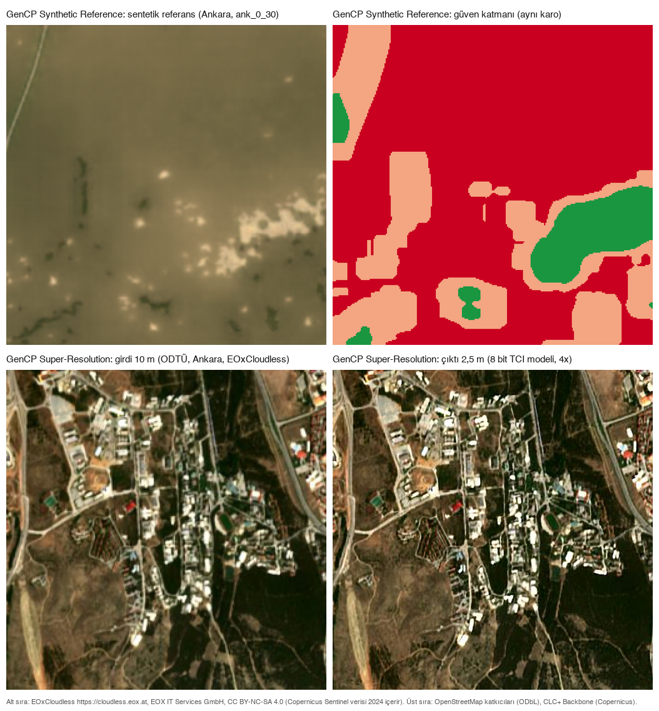
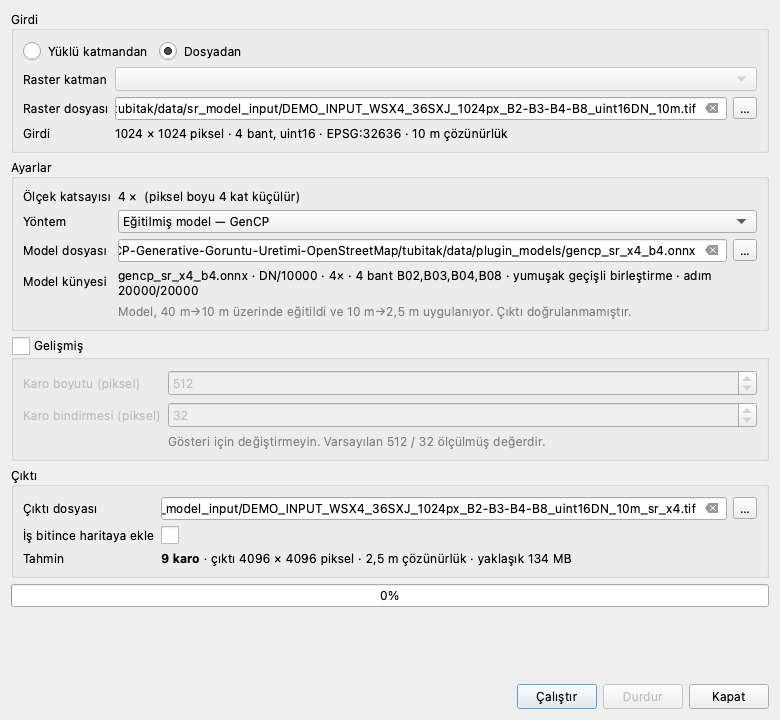

# GenCP: doğrulama çalışması ve iki QGIS eklentisi

ESA/Telespazio GenCP sisteminin bağımsız doğrulama çalışması ve o çalışmadan çıkan iki QGIS
eklentisi: harita verisinden sentetik referans üreten **GenCP Synthetic Reference** ile Sentinel-2
görüntüsünü süper çözünürlüğe çıkaran **GenCP Super-Resolution**. Kurumun indirdiği her dosya ve
okuduğu her kılavuz bu depodadır.

*Üst sıra, GenCP Synthetic Reference: solda Ankara demo karosu (`ank_0_30`, 2570 x 2570 m,
EPSG:32636) için OpenStreetMap ve CLC+ Backbone verisinden üretilen sentetik referans, sağda aynı
karonun güven katmanı (kırmızı kullanılmaz, turuncu dikkatle kullanılır, yeşil kullanılır). Alt
sıra, GenCP Super-Resolution: solda ODTÜ kampüsü, Ankara, EOxCloudless s2cloudless-2024
mozaiğinden 10 m girdi (2,56 x 2,56 km), sağda aynı girdinin 8 bit TCI modelinden geçmiş 4x, 2,5 m
çıktısı. Kaynak görseller `tubitak/docs/evidence/plugin_screens/06_canvas_output_only.png`,
`12_canvas_confidence_layer.png` ve `tubitak/sr/tools/make_slides_v2.py` betiğinin 1 Eylül 2026'da
ürettiği `03_ODTU_Ankara.png`; birleştiren betik [tools/make_hero.py](tools/make_hero.py). EOxCloudless
mozaiği EOX IT Services GmbH ürünüdür, CC BY-NC-SA 4.0 ile lisanslıdır ve Copernicus Sentinel verisi
(2024) içerir.*

## Bu depoda ne var

- **Doğrulama çalışması.** [telespazio-tim/GenCP](https://github.com/telespazio-tim/GenCP)
  sisteminin bağımsız ölçümü; TÜBİTAK UZAY stajı, Ağustos 2026. Bulgular, kayıtlar, veri ve sözlük:
  [docs/dogrulama-calismasi.md](docs/dogrulama-calismasi.md).
- **GenCP Synthetic Reference** (Proje 1). Seçilen bir alan için OpenStreetMap ve arazi örtüsü
  verisinden georeferanslı sentetik referans görüntü üreten QGIS eklentisi:
  [docs/proje1-eklenti.md](docs/proje1-eklenti.md).
- **GenCP Super-Resolution** (Proje 2). Sentinel-2 görüntüsünü 4x süper çözünürlüğe çıkaran QGIS
  eklentisi; kaynak kodu, belgeleri ve kılavuzu `tubitak/sr/` altındadır:
  [tubitak/sr/docs/10-kurulum.md](tubitak/sr/docs/10-kurulum.md).

## Hızlı başlangıç

1. QGIS'te **Eklentiler > Eklentileri Yönet ve Kur** penceresi açılır; **Ayarlar** sekmesinde
   **Deneysel eklentileri de göster** kutusu işaretlenir. İki eklenti de deneysel işaretlidir; kutu
   boşken eklenti kurulur ama listede görünmez.
2. Proje 2 için [`sr-plugin-v0.1.0`](https://github.com/mvy0502/gencp-validation/releases/tag/sr-plugin-v0.1.0) sayfasından
   `gencp_super_resolution.zip` indirilir; Proje 1 için [`plugin-v0.2.0`](https://github.com/mvy0502/gencp-validation/releases/tag/plugin-v0.2.0)
   sayfasından `gencp_plugin.zip` ve `gencp_C2_fp32.onnx`.
3. Aynı pencerenin **ZIP'ten Kur** sekmesinde indirilen zip seçilir ve **Eklentiyi Kur** düğmesine
   basılır; eklenti **Raster** menüsünde görünür.
4. İlk sonuç, Proje 2 ile: sürüm sayfasındaki `SAMPLE_3band_TCI_uint8_10m_512px.tif` QGIS'e
   eklenir, **Raster > GenCP Super-Resolution** açılır, yöntem olarak **bikübik** seçilip
   çalıştırılır; 2,5 m piksel boylu çıktı katman olarak gelir.
5. İnternet erişimi olmayan Windows bilgisayarı: kurulumdan önce QGIS'in Python konsolunda
   [`qgis_ortam_raporu.py`](tubitak/sr/tools/qgis_ortam_raporu.py) çalıştırılır; eksik paketler
   [`kit-win_amd64-py312-2026-08-31`](https://github.com/mvy0502/gencp-validation/releases/tag/kit-win_amd64-py312-2026-08-31) kitinden,
   [13-cevrimdisi-kurulum.md](tubitak/sr/docs/13-cevrimdisi-kurulum.md) adımlarıyla kurulur.
6. Her adımın ayrıntısı, doğrulaması ve sorun giderme tablosu:
   [10-kurulum.md](tubitak/sr/docs/10-kurulum.md).

## İki eklenti

### GenCP Synthetic Reference (Proje 1)

Bir referans katman seçilir; kapsam ve koordinat sistemi ondan okunur ve eklenti o alan için
OpenStreetMap ile CLC+ Backbone verisinden georeferanslı sentetik referans görüntü üretir. Her
pikselin girdiye ne ölçüde dayandığı çıktının dördüncü bandına güven değeri olarak yazılır; göz için
üç renkli bir güven katmanı da üretilebilir.

Sürüm: [`plugin-v0.2.0`](https://github.com/mvy0502/gencp-validation/releases/tag/plugin-v0.2.0). Kılavuz:
[docs/plugin/QUICKSTART.md](docs/plugin/QUICKSTART.md). Kurulum ayrıntısı, çalışma anında gereken
veri ve lisans, README'den olduğu gibi taşınan metniyle: [docs/proje1-eklenti.md](docs/proje1-eklenti.md).
Sınırlar: QGIS 4.2.1 ve macOS üzerinde doğrulanmıştır; QGIS 3.x ve Windows sınanmamıştır; yayımdaki
zip en düşük QGIS sürümü olarak 3.28 bildirir.

### GenCP Super-Resolution (Proje 2)

Sentinel-2 görüntüsünü, ızgarasını ve koordinat sistemini koruyarak 4x süper çözünürlüğe çıkarır:
10 m girdi 2,5 m piksel boylu çıktı olur. Amacı görüntü eşleştirmeye daha çok ayrıntı vermektir; üç
yöntem sunar: bikübik, eğitilmiş model ve referans model (wsx4).

Sürüm: [`sr-plugin-v0.1.0`](https://github.com/mvy0502/gencp-validation/releases/tag/sr-plugin-v0.1.0); eklenti, üç model dosyası, iki örnek raster ve
sağlama toplamları tek sayfadadır. Kılavuz: [10-kurulum.md](tubitak/sr/docs/10-kurulum.md); komut
satırı aracı: [20-komut-satiri.md](tubitak/sr/docs/20-komut-satiri.md); README'nin önceki özet
bölümü: [docs/proje2-eklenti.md](docs/proje2-eklenti.md). Sınırlar: eşleştirme kazancı 40 m'den
10 m'ye bozup geri kazanma deneyinde ölçülmüştür, 2,5 m'de yer gerçeği yoktur; Windows
sınanmamıştır; yayımdaki sürümde 8 bit model uint8 girdiyi reddeder ve bu açık bir maddedir
([18-depo-tasima.md](tubitak/sr/docs/18-depo-tasima.md) §19).

## Doğrulama çalışması

GenCP, OpenStreetMap haritalarını pix2pix üretici ağına verip sentetik Sentinel-2 görüntüsü üretir;
amaç bu görüntüleri yer kontrol noktası çıkarımı için telifsiz referans olarak kullanmaktır. Çalışma
yayımlanmış sistemi devralmış, yayımlanan üründe +1/256 georeferanslama ölçek hatasını bulmuş,
modelin haritada olmayan yapıları uydurduğunu ölçmüş, KARIOS ile geometrik doğruluğu yeniden
hesaplamış, kayıp fonksiyonu sorusu için modeli 2x2 faktöriyel düzende yeniden eğitmiş, Türkiye'ye
genelleme hattını kurmuş ve ODTÜ referans paketini üretmiştir. Bulguların tamamı, deney kod adları,
kullanılan veri, çalıştırma adımları ve sözlük, README'den olduğu gibi taşınan metniyle:
[docs/dogrulama-calismasi.md](docs/dogrulama-calismasi.md). Deney kayıtları ve sonuç dosyaları
[tubitak/docs/](tubitak/docs/) altındadır.

## Sürümler

| Etiket | İçerik | Boyut | Kimin için | Durum |
|---|---|---|---|---|
| [`plugin-v0.2.0`](https://github.com/mvy0502/gencp-validation/releases/tag/plugin-v0.2.0) | `gencp_plugin.zip`, `gencp_C2_fp32.onnx` | 94.987 bayt, 217.678.087 bayt | Proje 1 kullanıcıları | güncel |
| [`sr-plugin-v0.1.0`](https://github.com/mvy0502/gencp-validation/releases/tag/sr-plugin-v0.1.0) | `gencp_super_resolution.zip`, üç model dosyası, iki örnek raster, `SHA256SUMS.txt` | toplam 8.517.351 bayt | Proje 2 kullanıcıları | güncel |
| [`kit-win_amd64-py312-2026-08-31`](https://github.com/mvy0502/gencp-validation/releases/tag/kit-win_amd64-py312-2026-08-31) | 18 tekerlek (zip), `MANIFEST.json`, `SHA256SUMS.txt` | 67.325.080 bayt | İnternet erişimi olmayan Windows bilgisayarları, iki eklenti | güncel; Pillow ve PyYAML dahil |
| [`veri-turkiye-2026-08-31`](https://github.com/mvy0502/gencp-validation/releases/tag/veri-turkiye-2026-08-31) | `clcplus_2021_turkey_10m.tif`, `turkey-2026-08-19.osm.pbf` | 916.422.550 bayt, 642.343.710 bayt | Proje 1'i Türkiye'de çalıştıranlar | güncel |
| [`osm-turkey-2026-08-19`](https://github.com/mvy0502/gencp-validation/releases/tag/osm-turkey-2026-08-19) | `turkey-2026-08-19.osm.pbf` | 642.343.710 bayt | eklentinin sabitlenmiş yedek adresi | uyumluluk |

## Lisans ve atıf

Upstream kod **BSD 3-Clause** lisanslıdır ([LICENSE](LICENSE)); telif bildirimleri korunmuştur.
Temel mimari [pytorch-CycleGAN-and-pix2pix](https://github.com/junyanz/pytorch-CycleGAN-and-pix2pix)
(Isola vd. 2017, Zhu vd. 2017); GenCP projesi ve özgün belgeler
[telespazio-tim/GenCP](https://github.com/telespazio-tim/GenCP). Proje 1'in model ağırlıkları
GenCP'nin CC-BY 4.0 lisanslı ağırlıklarından türetilmiştir. Proje 1 çalışma anında OpenStreetMap
verisi okur; OSM verisi ODbL lisanslıdır ve
[OpenStreetMap katkıcılarına](https://www.openstreetmap.org/copyright) atıf gerektirir. CLC+
Backbone, Copernicus Land Monitoring Service ürünüdür. Kapak görselindeki EOxCloudless mozaiği
CC BY-NC-SA 4.0 lisanslıdır ve ticari kullanıma kapalıdır.

## Sorun bildirme

Sorunlar [GitHub issues](https://github.com/mvy0502/gencp-validation/issues) sayfasına bildirilir;
iletişim: Mustafa Vedat Yıldırım ([@mvy0502](https://github.com/mvy0502)). Bildirimin ilk eki, QGIS'in
Python konsolunda çalıştırılan [`qgis_ortam_raporu.py`](tubitak/sr/tools/qgis_ortam_raporu.py)
betiğinin çıktısıdır; ona hangi eklenti ve hangi sürüm etiketi olduğu, QGIS sürümü (**Yardım >
Hakkında**), işletim sistemi, yapılan adımlar ve hata iletisinin tam metni eklenir.

Depo bakım kuralları (üç deponun rolü ve birleştirme yasağı): [MAINTAINERS.md](MAINTAINERS.md).
