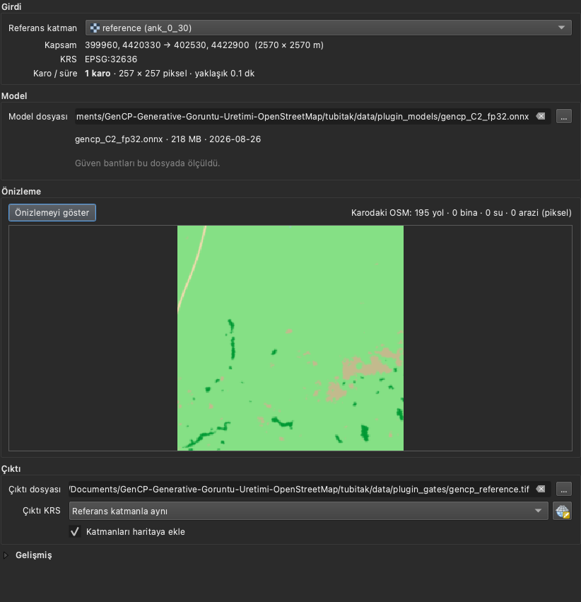
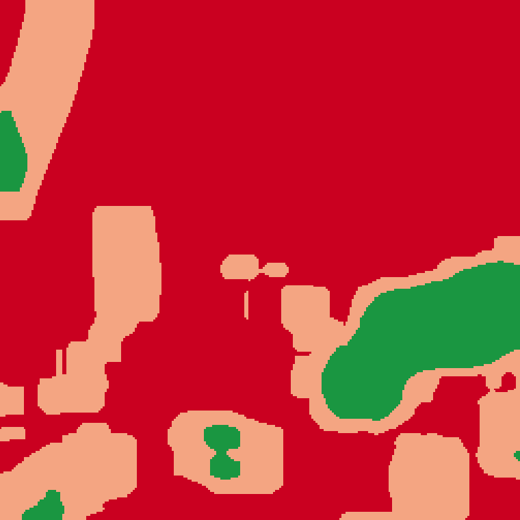

# GenCP Synthetic Reference (Proje 1): README'den taşınan tam metin

Aşağıdaki metin, deponun kök `README.md` dosyasının Proje 1 bölümleridir (Kurulum, Eklenti, Ayrıntı,
Lisans ve atıf) ve 3 Eylül 2026'da (WP27) olduğu gibi buraya taşınmıştır. Metne dokunulmamıştır;
yalnızca göreli bağlantı ve görsel yolları, bu dosya `docs/` dizininde bulunduğu için, başlarına `../`
eklenerek depo köküne göre yeniden çözülür hâle getirilmiştir. Kısa tanıtım ve hızlı başlangıç kök
[README.md](../README.md) dosyasındadır; iki eklentinin ortak kurulum kılavuzu
[tubitak/sr/docs/10-kurulum.md](../tubitak/sr/docs/10-kurulum.md) dosyasıdır.

---

## Kurulum

**İndirin**

| Dosya | Boyut | |
|---|---|---|
| **gencp_plugin.zip** | 73 KB | [indir](https://github.com/mvy0502/gencp-validation/releases/latest/download/gencp_plugin.zip) |
| **gencp_C2_fp32.onnx** | 208 MB | [indir](https://github.com/mvy0502/gencp-validation/releases/latest/download/gencp_C2_fp32.onnx) |

[Sürüm sayfası ve notlar](https://github.com/mvy0502/gencp-validation/releases/latest)

**QGIS'e kurun**

**Eklentiler > Eklentileri Yönet ve Kur** penceresini açın. **Ayarlar** sekmesinde
**Deneysel eklentileri de göster** kutusunu işaretleyin — eklenti deneysel işaretli, bu
kutu boşken kurulur ama listede görünmez. **ZIP'ten Kur** sekmesinden indirdiğiniz dosyayı
seçip kurun.

Eklenti **Raster > GenCP > GenCP Synthetic Reference** altında ve araç çubuğunda çıkar.
Model dosyasının yolunu Model bölümünde bir kez gösterirsiniz, sonra hatırlanır.

**`onnxruntime`**

Üretim sırasında `No module named 'onnxruntime'` hatası alırsanız kütüphane QGIS'in kendi
Python'unda yok demektir. Başka bir Python'a kurmak işe yaramaz:

```bash
# QGIS > Eklentiler > Python Konsolu:  import sys; print(sys.executable)
# terminalde, çıkan yolu kullanarak:
/Applications/QGIS.app/Contents/MacOS/bin/python3 -m pip install onnxruntime
```

Yerel `.osm.pbf` kullanacaksanız `osmium` da gerekir. Kurulumdan sonra QGIS'i kapatıp açın.

**Ayrıca gerekenler:** CLC+ Backbone 2021 rasterı (Copernicus Land Monitoring Service) ve
çalışılacak alanı kapsayan bir `.osm.pbf`. İsterseniz eklenti OSM verisini Overpass'tan
çevrimiçi okur, o zaman bu dosya gerekmez.

### Eklenti



Referans katmanı seçersiniz; kapsam ve koordinat sistemi ondan okunur. Sonra **Üret**
düğmesine basarsınız.
Çıktının yanında modelin gördüğü rasterleştirilmiş girdi de katman olarak eklenir.

Her pikselin ne ölçüde girdiye dayandığı, çıktının **alfa kanalına** ölçülmüş bir değer
olarak yazılır. 4. bant güvendir; onu saydamlık sayan yazılım görüntüyü altındaki katmanla
harmanlar. Göz için üç renkli ayrı bir katman da üretilebilir:



Kırmızı bölgeler kullanılmamalı, turuncu bölgeler dikkatle kullanılmalı, yeşil bölgeler
kullanılabilir. Bant sınırları 150 karoluk ayrık Avrupa kümesinde ölçüldü, 130 karoluk
Ankara kümesinde sınandı. Sayılar ve ölçümün sınırları, olumsuz bulgular dâhil, şu iki
dosyada: [confidence-results.md](../tubitak/docs/confidence-results.md) ve
[confidence-transfer-results.md](../tubitak/docs/confidence-transfer-results.md).

### Ayrıntı

| | |
|---|---|
| Adım adım kullanım | [`docs/plugin/QUICKSTART.md`](../docs/plugin/QUICKSTART.md) |
| Eklentinin mimarisi ve bilinen sınırları | [`tubitak/qgis_plugin/README.md`](../tubitak/qgis_plugin/README.md) |
| Güven skorunun ön kaydı ve sonucu | [ön kayıt](../tubitak/docs/confidence-registration.md) · [sonuç](../tubitak/docs/confidence-results.md) |
| Gerçek QGIS kurulumunda çıkan bulgular | [`plugin-field-test.md`](../tubitak/docs/plugin-field-test.md) |
| Terim karşılıkları | [`tubitak/docs/terimler.md`](../tubitak/docs/terimler.md) |

Doğrulandığı ortam: QGIS 4.2.1 (Qt 6), macOS. QGIS 3.28 için kod uyumlu yazıldı, denenmedi;
Windows denenmedi.

### Lisans ve atıf

Model ağırlıkları GenCP'nin CC-BY 4.0 lisanslı ağırlıklarından türetilmiştir; atıf
[telespazio-tim/GenCP](https://github.com/telespazio-tim/GenCP) projesinedir. Eklenti
çalışma anında OpenStreetMap verisi okur; OSM verisi ODbL lisanslıdır ve
[OpenStreetMap katkıcılarına](https://www.openstreetmap.org/copyright) atıf gerektirir.
CLC+ Backbone, Copernicus Land Monitoring Service ürünüdür.

